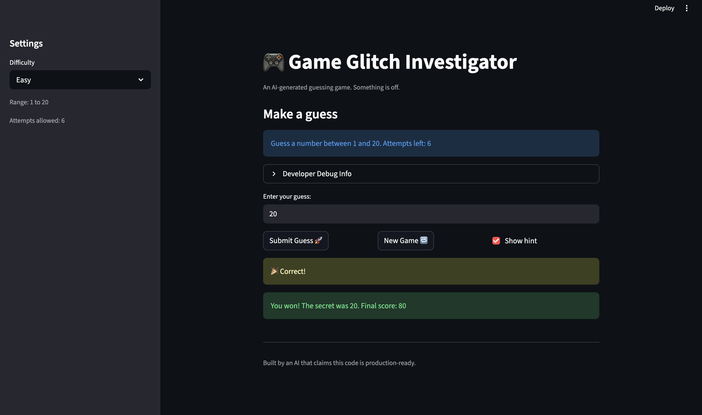

# 🎮 Game Glitch Investigator: The Impossible Guesser

## 🚨 The Situation

You asked an AI to build a simple "Number Guessing Game" using Streamlit.
It wrote the code, ran away, and now the game is unplayable. 

- You can't win.
- The hints lie to you.
- The secret number seems to have commitment issues.

## 🛠️ Setup

1. Install dependencies: `pip install -r requirements.txt`
2. Run the broken app: `python -m streamlit run app.py`

## 🕵️‍♂️ Your Mission

1. **Play the game.** Open the "Developer Debug Info" tab in the app to see the secret number. Try to win.
2. **Find the State Bug.** Why does the secret number change every time you click "Submit"? Ask ChatGPT: *"How do I keep a variable from resetting in Streamlit when I click a button?"*
3. **Fix the Logic.** The hints ("Higher/Lower") are wrong. Fix them.
4. **Refactor & Test.** - Move the logic into `logic_utils.py`.
   - Run `pytest` in your terminal.
   - Keep fixing until all tests pass!

## 📝 Document Your Experience

- [ ] Describe the game's purpose.
The game is a Streamlit number-guessing app where the player chooses a difficulty, guesses a secret number in a defined range, and gets feedback (Too High, Too Low, or Win) within a limited number of attempts.

- [ ] Detail which bugs you found.

I found three main issues:
*  Hint direction was reversed (Too High/Too Low guidance was wrong).
* Clicking New Game did not properly reset and start a fresh game.
* Changing difficulty did not correctly enforce the new range for the secret number.

- [ ] Explain what fixes you applied.
* I refactored the app to use shared logic from logic_utils.py (get_range_for_difficulty, parse_guess, check_guess, update_score) instead of duplicating logic in app.py. I fixed session-state handling so the secret stays stable across reruns, resets correctly on New Game, and regenerates correctly when difficulty changes. I also added pytest checks (including hint-message regression tests) and manual UI validation to confirm the fixes.

## 📸 Demo

- [ ] [Insert a screenshot of your fixed, winning game here]

## 🚀 Stretch Features

- [ ] [If you choose to complete Challenge 4, insert a screenshot of your Enhanced Game UI here]
